# Mermaid Quick Reference — Mermaid 빠른 참조
> sf-diagram에서 사용하는 Mermaid 다이어그램 문법(시퀀스·ERD·플로우차트·테마·특수문자) 빠른 참조 가이드.

---

<!-- Parent: external-diagram-mermaid-generate/SKILL.md -->
# Mermaid Quick Reference

Quick reference guide for Mermaid diagram syntax used in sf-diagram.

## Sequence Diagrams

### Basic Syntax

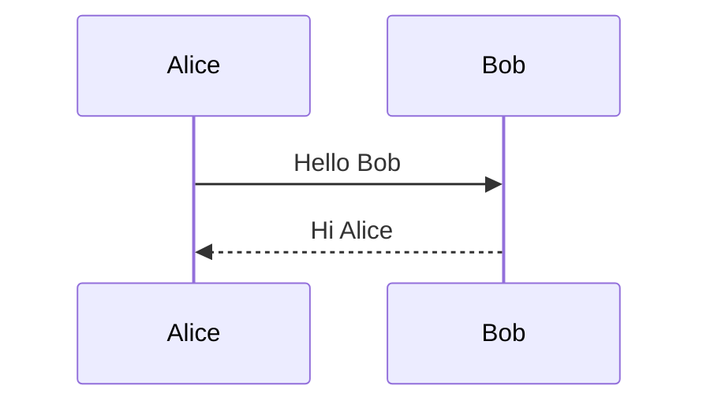

### Arrow Types

| Arrow | Meaning | Usage |
|-------|---------|-------|
| `->` | Solid line, no head | Internal processing |
| `-->` | Dotted line, no head | Optional/weak connection |
| `->>` | Solid line, arrowhead | Request/Call |
| `-->>` | Dotted line, arrowhead | Response/Return |
| `-x` | Solid line, X end | Failed/Cancelled |
| `--x` | Dotted line, X end | Failed response |
| `-)` | Solid, open arrow | Async (fire-and-forget) |
| `--)` | Dotted, open arrow | Async response |

### Participants and Actors

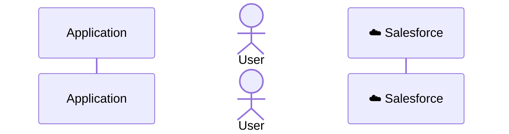

### Grouping with Boxes

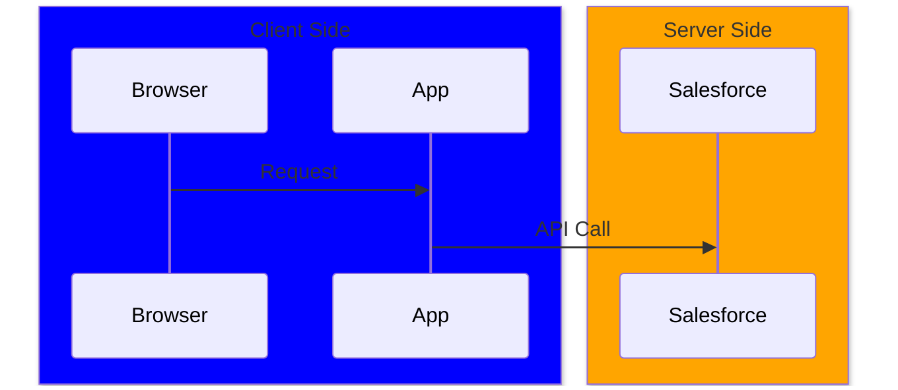

### Activation (Lifelines)

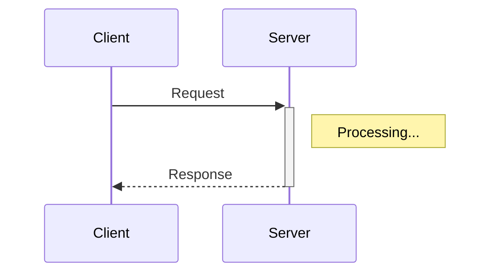

Shorthand: `+` activates, `-` deactivates

### Loops and Conditionals

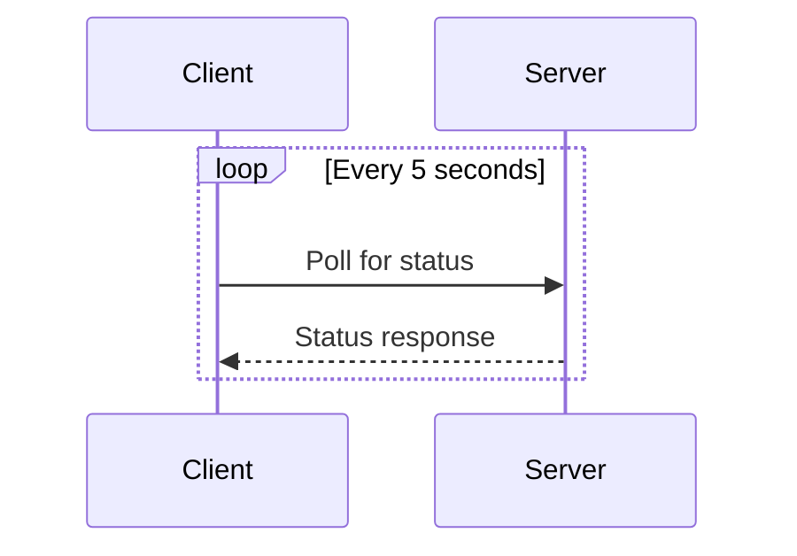

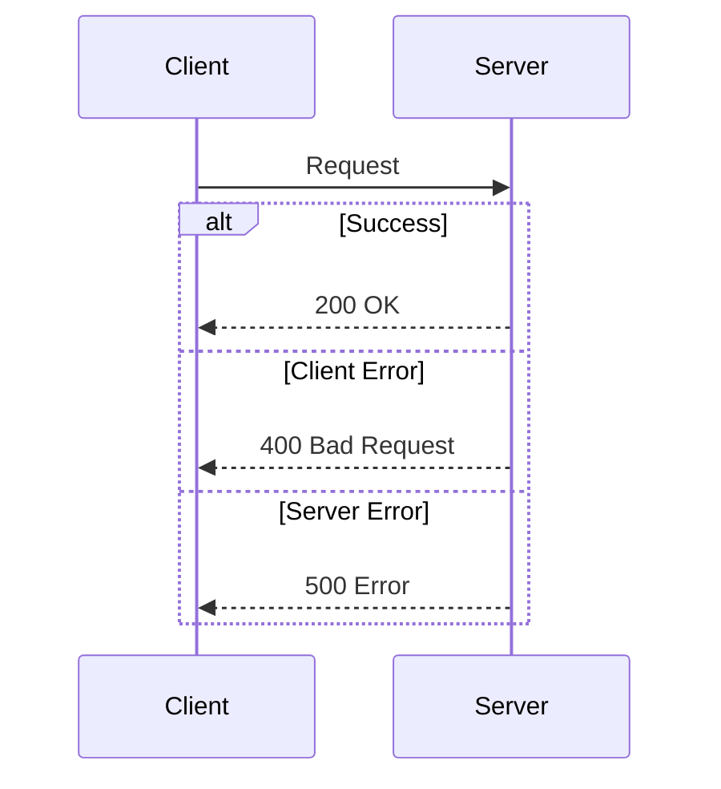

### Notes

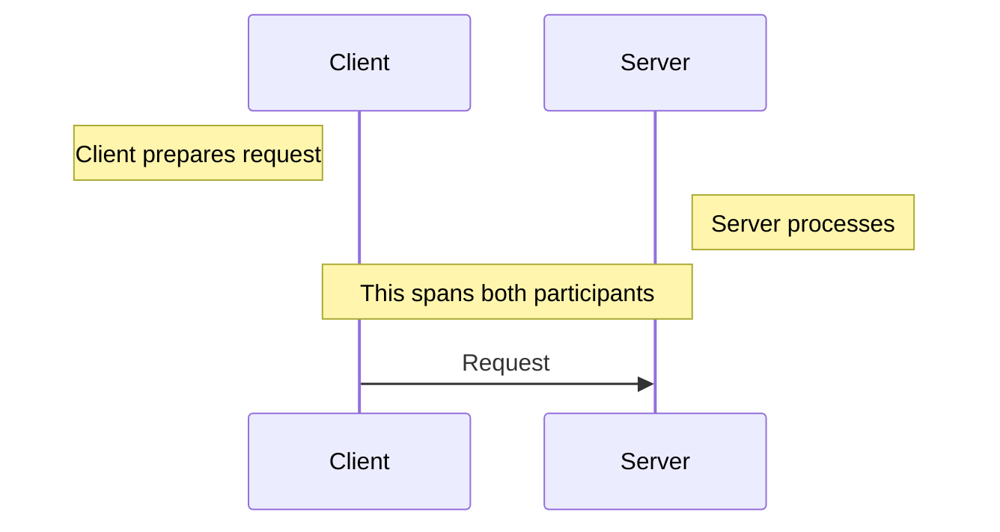

### Autonumber

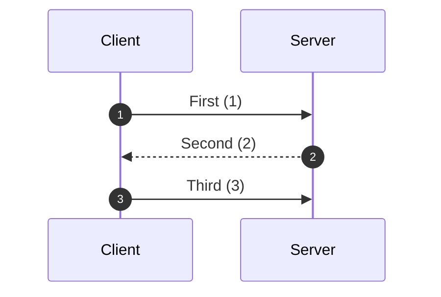

### Breaks and Critical Sections

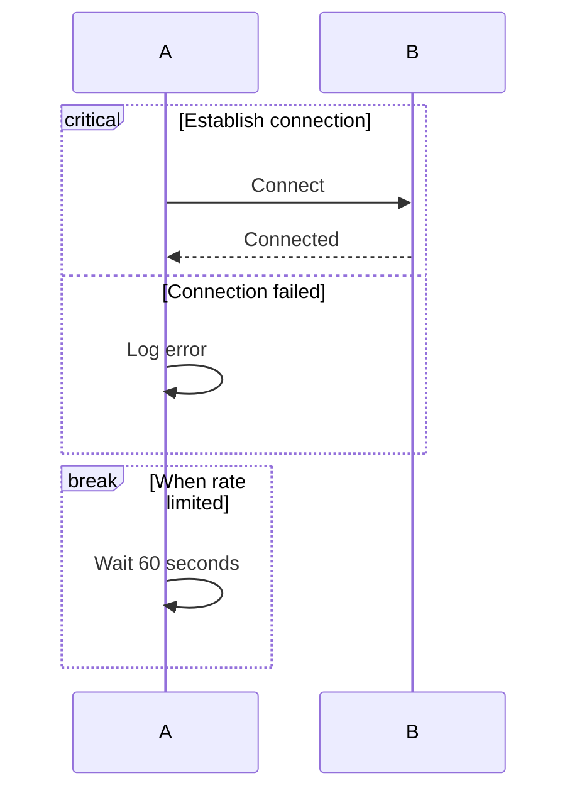

---

## Entity Relationship Diagrams

### Basic Syntax

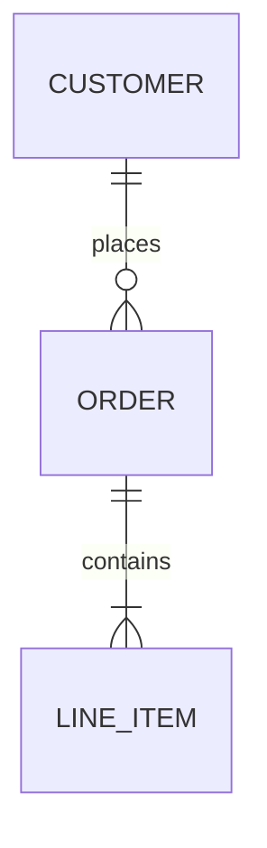

### Cardinality Notation

| Symbol | Meaning |
|--------|---------|
| `\|o` | Zero or one |
| `\|\|` | Exactly one |
| `}o` | Zero or many |
| `}\|` | One or many |

### Full Cardinality Examples

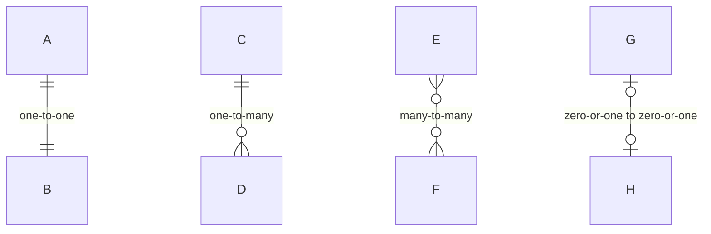

### Entity Attributes

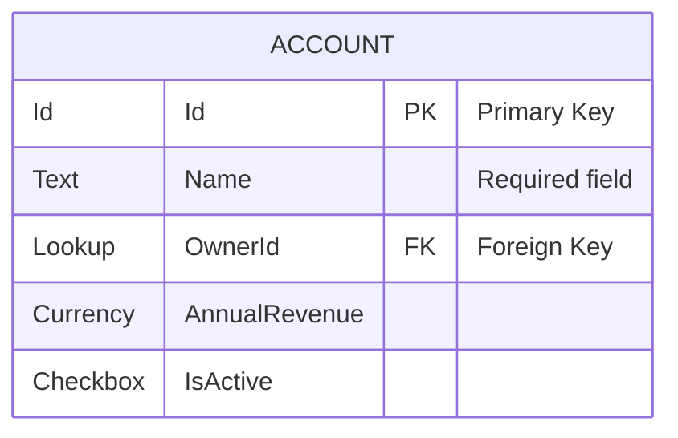

### Attribute Keys

| Key | Meaning |
|-----|---------|
| PK | Primary Key |
| FK | Foreign Key |
| UK | Unique Key |

---

## Flowcharts

### Basic Syntax

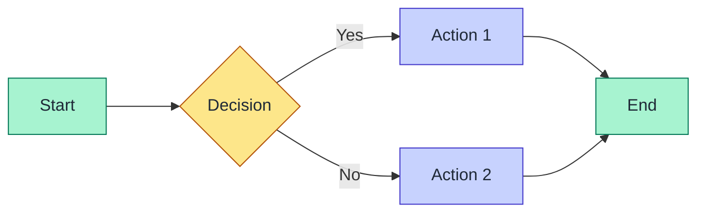

### Direction

| Code | Direction |
|------|-----------|
| `TB` / `TD` | Top to Bottom |
| `BT` | Bottom to Top |
| `LR` | Left to Right |
| `RL` | Right to Left |

### Node Shapes

```mermaid
flowchart LR
    A[Rectangle]
    B(Rounded)
    C([Stadium])
    D&#91;&#91;Subroutine&#93;&#93;
    E[(Database)]
    F((Circle))
    G>Asymmetric]
    H{Diamond}
    I{{Hexagon}}
    J[/Parallelogram/]
    K[\Parallelogram alt\]
    L[/Trapezoid\]
    M[\Trapezoid alt/]
```

> 참고: 위 `D` 노드의 Subroutine(이중 사각형) 셰이프 원본 문법은 대괄호 두 쌍 `[` `[` Subroutine `]` `]` 입니다. 위키 링크 린터의 오탐을 피하려고 HTML 엔티티(`&#91;&#91;...&#93;&#93;`)로 표기했으니, 실제 사용 시 대괄호 두 쌍으로 작성하세요.

### Link Types

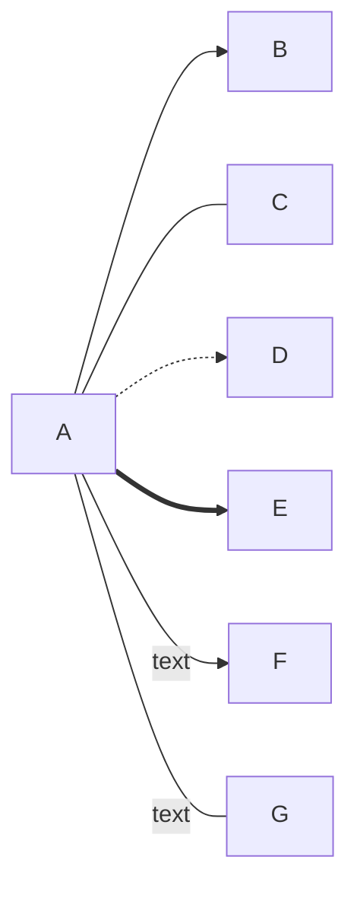

| Link | Description |
|------|-------------|
| `-->` | Arrow |
| `---` | Line (no arrow) |
| `-.->` | Dotted arrow |
| `==>` | Thick arrow |
| `--text-->` | Arrow with text |

### Subgraphs

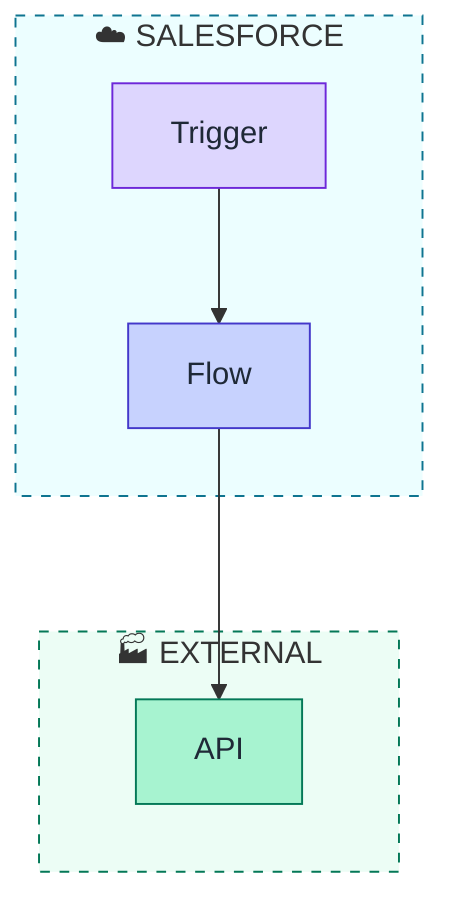

---

## Theming

### Init Directive

For spacing configuration (recommended):
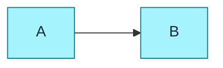

For theme variables (legacy - prefer individual `style` declarations):
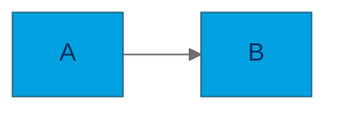

### Available Themes

| Theme | Description |
|-------|-------------|
| `default` | Standard theme |
| `base` | Base for customization |
| `dark` | Dark mode |
| `forest` | Green tones |
| `neutral` | Grayscale |

### Common Theme Variables

**Sequence Diagrams:**
- `actorBkg`, `actorTextColor`, `actorBorder`
- `signalColor`, `signalTextColor`
- `labelBoxBkgColor`, `labelTextColor`
- `noteBkgColor`, `noteTextColor`

**ER Diagrams:**
- `primaryColor`, `primaryTextColor`
- `lineColor`
- `attributeBackgroundColorOdd/Even`

**Flowcharts:**
- `primaryColor`, `primaryTextColor`
- `lineColor`, `nodeBorder`
- `mainBkg`, `clusterBkg`

---

## Special Characters

### Escaping

Use `#` codes for special characters:

| Code | Character |
|------|-----------|
| `#quot;` | " |
| `#amp;` | & |
| `#lt;` | < |
| `#gt;` | > |
| `#59;` | ; |

### Line Breaks in Text

Use `<br/>` for line breaks:

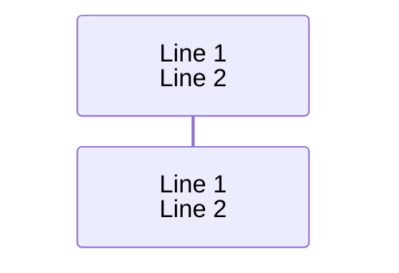

---

## Tips and Tricks

### 1. Comments

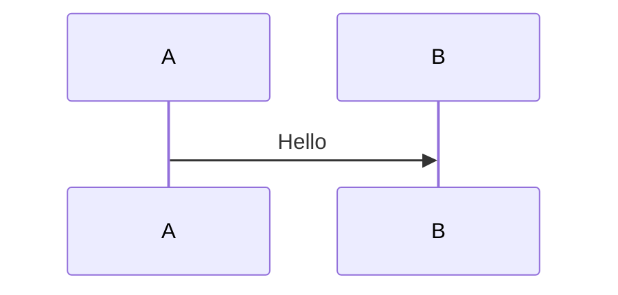

### 2. Multiline Notes

```mermaid
sequenceDiagram
    Note over A,B: Line 1<br/>Line 2<br/>Line 3
```

### 3. Styling Individual Nodes

Using `style` declarations (sf-skills standard):
```mermaid
%%{init: {"flowchart": {"nodeSpacing": 80, "rankSpacing": 70}} }%%
flowchart LR
    A[Success] --> B[Error]

    style A fill:#a7f3d0,stroke:#047857,color:#1f2937
    style B fill:#fecaca,stroke:#b91c1c,color:#1f2937
```

Using `classDef` (alternative approach):
```mermaid
flowchart LR
    A:::success --> B:::error

    classDef success fill:#a7f3d0,stroke:#047857,color:#1f2937
    classDef error fill:#fecaca,stroke:#b91c1c,color:#1f2937
```

### 4. Click Events (Interactive)

```mermaid
flowchart LR
    A[Salesforce Docs]
    click A "https://developer.salesforce.com" "Open Docs"
```

---

## Resources

- [Mermaid Official Docs](https://mermaid.js.org/intro/)
- [Mermaid Live Editor](https://mermaid.live/)
- [Sequence Diagram Syntax](https://mermaid.js.org/syntax/sequenceDiagram.html)
- [ER Diagram Syntax](https://mermaid.js.org/syntax/entityRelationshipDiagram.html)
- [Flowchart Syntax](https://mermaid.js.org/syntax/flowchart.html)

## 관련 노트
- [[external-diagram-mermaid-generate]]
- [[mermaid-styling]]
- [[diagram-conventions]]
