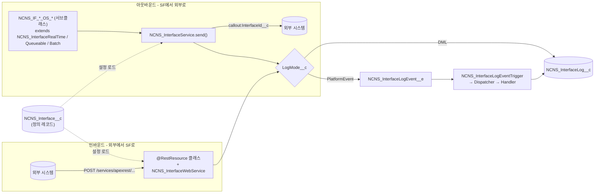
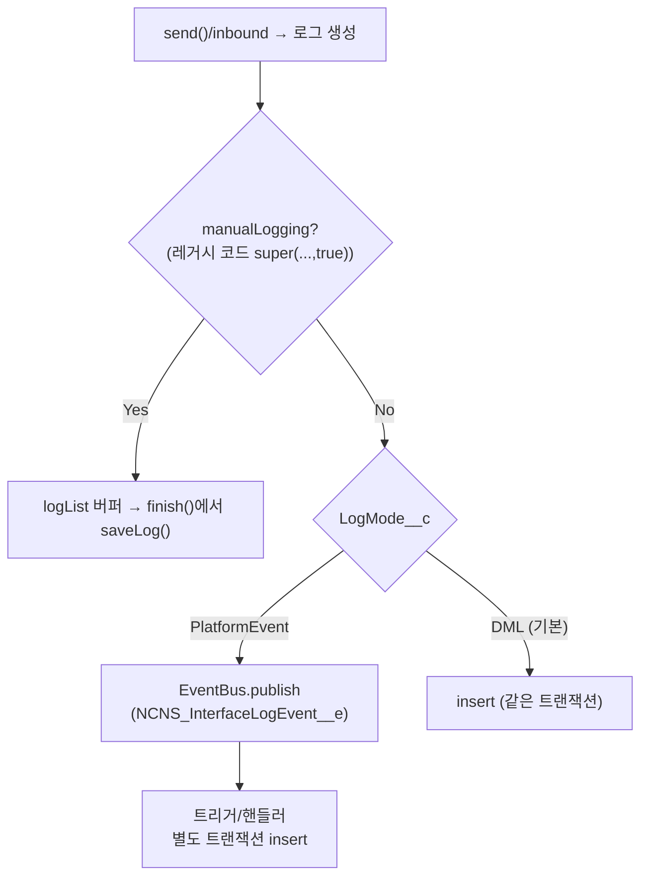

# NCNS 인터페이스 프레임워크 — 핸드오버 & 사용자 가이드

> **대상**: LG CNS Sales(LGCNS_Dev) 조직의 **신형(NCNS) 외부 연동 인터페이스 프레임워크**를 유지·개발하는 담당자.
> **범위**: 구조·구성요소·설정·회복탄력성 기능 + 신규 인터페이스 작성/운영 사용자 가이드.
> 최종 갱신: 2026-07-08 · [문서 인덱스](index.md) · 관련: [재플랫폼 설계서](cmp-interface-replatform-plan.md), [콜아웃 로그 가이드](ncns-callout-logging-guide.md).
> 동일 내용 HTML(사이드바·다이어그램): `NCNS_Interface_Framework_Handover.html`

---

## 1. 개요

NCNS 프레임워크는 Salesforce → 외부 시스템(아웃바운드) 및 외부 → Salesforce(인바운드) 연동을 **설정 기반(config-over-code)** 으로 처리하는 신형 인터페이스 엔진이다. 인터페이스 1건 = **정의 레코드(`NCNS_Interface__c`) 1개 + 서브클래스 1개**이며, 콜아웃·로그 적재·재시도·타임아웃 등 공통 로직은 프레임워크가 담당한다.

- **언제 쓰나**: **신규 인터페이스는 전부 NCNS로 작성**한다.
- **구형과의 관계**: 구형 프레임워크(`InterfaceUtil`, `IF_CD_Util`, `NsInterfaceUtil` 등, 운영 인터페이스 약 50+ 클래스)와 **병행 운영**한다. 구형은 그대로 두고, 신규만 NCNS.
- **2026-07 재플랫폼**으로 회복탄력성(자동 재시도·플랫폼이벤트 로깅·타깃 토글·타임아웃·관측성 필드)이 추가되었다. 전부 **기본 OFF**라 기존 동작에 영향 없음.

> 이 프레임워크의 로그·설정 객체는 NCNS 고유(`NCNS_Interface__c`/`NCNS_InterfaceLog__c`)이며, 참고 원본이던 MCM의 `IFProgram__c`/`IFProgramLog__c`는 도입하지 않았다.

## 2. 아키텍처



- **코어**: `NCNS_InterfaceService` — HttpRequest 빌드·콜아웃(재시도)·상태판정·로그 레코드 생성.
- **추상 베이스**(아웃바운드): `NCNS_InterfaceRealTime`(동기), `NCNS_InterfaceQueueable`(비동기), `NCNS_InterfaceBatch`(배치). 개발자는 `before()`/`after()`만 구현.
- **인바운드 헬퍼**: `NCNS_InterfaceWebService` — 정의 로드/에러/응답 + 로그.
- **로그 파이프라인**: `NCNS_InterfaceLog__c` + (선택) `NCNS_InterfaceLogEvent__e` 플랫폼이벤트 + 트리거/핸들러 + `ncns_InterfaceLog` LWC 뷰어.

## 3. 구성요소

| 유형 | 이름 | 역할 |
|------|------|------|
| 설정 객체 | `NCNS_Interface__c` | 인터페이스 정의(엔드포인트/메서드/성공코드/재시도/로그방식 등) |
| 로그 객체 | `NCNS_InterfaceLog__c` | 요청/응답/상태/시각/에러 이력 (+ `ncns_InterfaceLog` LWC) |
| 플랫폼이벤트 | `NCNS_InterfaceLogEvent__e` | 로그를 별도 트랜잭션으로 분리 적재(선택) |
| CMDT | `NCNS_CalloutTargetActive__mdt` | 타깃 시스템 단위 on/off(긴급 차단) |
| 코어 | `NCNS_InterfaceService` | 콜아웃/재시도/로그 엔진 |
| 베이스 | `NCNS_InterfaceRealTime` / `NCNS_InterfaceQueueable` / `NCNS_InterfaceBatch` | 아웃바운드 서브클래스 상위(템플릿 메서드) |
| 인바운드 | `NCNS_InterfaceWebService` | `@RestResource` 헬퍼 |
| 트리거 | `NCNS_InterfaceLogEventTrigger` (+Dispatcher/Handler) | PE 수신 → 로그 벌크 insert |
| 템플릿 | `NCNS_IF_SAMPLE_OS_Callout` / `NCNS_IF_SAMPLE_IS_Inbound` / `SAMPLE_Interface*` | 복제용 샘플 |

## 4. 설정 — `NCNS_Interface__c` 필드

인터페이스 동작은 코드가 아니라 이 레코드로 제어한다.

| 필드 | 값(예) | 용도 |
|------|--------|------|
| `Name` | `NCNS_IF_ACME_OS_Something` | 서브클래스 `super(IF_ID, ...)`의 IF_ID |
| `IsActive__c` | ✅ | 활성 여부(비활성이면 정의 조회 안 됨) |
| `InterfaceId__c` | (Named Credential 이름) | 엔드포인트 `callout:InterfaceId__c` |
| `Method__c` | `POST`/`GET` | HTTP 메서드 (POST만 body 전송) |
| `SuccessfulStatusCode__c` | `200`(멀티셀렉트) | 성공으로 볼 상태코드 |
| `Certificate__c` | (선택) | mTLS 클라이언트 인증서 |
| `Timeout__c` | (선택) ms | 인터페이스별 타임아웃(미설정 시 120000) |
| `IsRetry__c` / `RetryCount__c` | (선택) | 자동 재시도(멱등=GET만) / 최대 횟수 |
| `RetryableStatusCodes__c` | (선택) CSV | 재시도 대상 코드(기본 `408,502,503,504`) |
| `LogMode__c` | `DML`(기본)/`PlatformEvent` | **로그 저장 방식**(§6) |
| `Target__c` | (선택) | 타깃 시스템 키(→ `NCNS_CalloutTargetActive__mdt`) |

## 5. 회복탄력성 기능 (2026-07 재플랫폼)

전부 **레코드 설정으로 on**, 기본 OFF.

| 기능 | 켜는 법 | 설명 |
|------|---------|------|
| **자동 재시도(즉시)** | `IsRetry__c=true`, `RetryCount__c` | 재시도 대상 코드(408/502/503/504)에서 대기 없이 재시도. GET(멱등)만. 429 기본 제외 |
| **타임아웃** | `Timeout__c`(ms) | 인터페이스별 HTTP 타임아웃 |
| **로그 트랜잭션 분리** | `LogMode__c='PlatformEvent'` | 다중 콜아웃/루프에서 "uncommitted work pending before callout" 회피 |
| **타깃 긴급 차단** | `Target__c` + `NCNS_CalloutTargetActive__mdt`의 `isActive__c=false` | 시스템 단위 콜아웃 즉시 차단 |
| **관측성** | 자동 | `StatusCode__c`·`RequestTime__c`/`ResponseTime__c`·`ResponseHeader__c` 매 콜아웃 자동 기록 |
| **추적 로그** | 서브클래스 `appendLog('...')` | `LogText__c`에 누적 |

> 실제 인터페이스에 플래그를 켜기 전엔 운영 동작 변화가 없다(전부 기본 OFF). 자동 테스트로 로직 검증 완료(17/17).

## 6. 로그 저장 방식 — `LogMode__c` (2택)



| 값 | 동작 | 언제 |
|----|------|------|
| **`DML`** (기본) | 콜아웃 직후 `insert` | 일반 단건 콜아웃 |
| **`PlatformEvent`** | `NCNS_InterfaceLogEvent__e` 발행 → 트리거가 별도 트랜잭션에서 insert | 다중 콜아웃/루프에서 트랜잭션 분리 |

`LogMode__c` 값만 바꾸면 즉시 적용(배포 불필요). 버퍼(수동 로깅)는 config가 아니라 코드(`super(...,true)` + `finish()`에서 `INF.saveLog()`)로만 쓰는 레거시 패턴.

## 7. 사용자 가이드

### 7-1. 아웃바운드 콜아웃 만들기

```apex
public with sharing class NCNS_IF_ACME_OS_Something extends NCNS_InterfaceRealTime {
    private static final String IF_ID = 'NCNS_IF_ACME_OS_Something';   // = NCNS_Interface__c.Name
    private final Request req;

    public NCNS_IF_ACME_OS_Something(Request req) {
        super(IF_ID, Response.class);   // 단일 인터페이스 → 즉시 로깅
        this.req = req;
    }
    public override Object before() {
        appendLog('[OK] before: ' + JSON.serialize(req));   // LogText__c 누적
        INF.keyList.add(req.id);                            // 로그 조회 키
        return req;                                         // GET이면 queryParameterMap 사용 후 return null
    }
    public override void after(NCNS_InterfaceService.ReturnCls rc) {
        Response res = (Response) rc.responseObject;
        appendLog('[OK] after: statusCode=' + rc.log.StatusCode__c);
        // 업무 로직 (upsert 등). 비즈니스 실패는: if('FAIL'.equals(res.resultCode)) { INF.error(rc, res.message); return; }
    }
    public class Request  { public String id; public String keyword; }
    public class Response { public String resultCode; public String message; }
}
```

**호출**
```apex
NCNS_InterfaceService.ReturnCls rc = new NCNS_IF_ACME_OS_Something(req).execute();       // 동기
// System.enqueueJob(new NCNS_IF_ACME_OS_SomethingQ(req));                              // 비동기(Queueable)
```

**선행조건**: `NCNS_Interface__c` 레코드(`Name=IF_ID`, `IsActive__c=true`, `Method__c`, `InterfaceId__c`(NC), `SuccessfulStatusCode__c`) + Named Credential.
복제용 샘플: **`NCNS_IF_SAMPLE_OS_Callout`**.

### 7-2. 인바운드 REST 만들기

```apex
@RestResource(UrlMapping='/cmp/acme/inbound')
global with sharing class NCNS_IF_ACME_IS_Something {
    @HttpPost
    global static ReturnCls httpPost() {
        ReturnCls rc = new ReturnCls();
        rc.message = NCNS_InterfaceWebService.setInterfaceInfo('NCNS_IF_ACME_IS_Something');  // 정의 로드
        if (String.isNotBlank(rc.message)) { rc.status = 'SYSTEM ERROR'; return rc; }

        String body = RestContext.request?.requestBody?.toString();
        if (String.isBlank(body)) { NCNS_InterfaceWebService.error('내용 없음','REQUEST ERROR'); rc.status='REQUEST ERROR'; return rc; }

        RequestCls req = (RequestCls) JSON.deserialize(body, RequestCls.class);   // 타입 지정(Map<String,Object> 금지)
        // ... 유효성/업무 로직 ...
        return (ReturnCls) NCNS_InterfaceWebService.response(rc);                  // 로그 저장 + 반환
    }
    global class ReturnCls { public String status='SUCCESS'; public String message; public Integer total; }
    private class RequestCls { private Body body; }
    private class Body { private List<RecordCls> records; }
    private class RecordCls { private String code; private String name; }
}
```

**선행조건**: `NCNS_Interface__c` 레코드(RecordType `Inbound`, `InterfaceId__c` = `setInterfaceInfo` 인자).
복제용 샘플: **`NCNS_IF_SAMPLE_IS_Inbound`**, `SAMPLE_InterfaceWebService`.

### 7-3. 운영 — 설정만으로 조정

| 하고 싶은 것 | 방법 |
|-------------|------|
| 재시도 켜기 | 레코드 `IsRetry__c=true`, `RetryCount__c=2` |
| 로그를 트랜잭션 분리 | `LogMode__c='PlatformEvent'` |
| 타임아웃 늘리기 | `Timeout__c=30000` |
| 특정 시스템 긴급 차단 | `Target__c` 채우고 `NCNS_CalloutTargetActive__mdt`의 해당 행 `isActive__c=false` |
| 인터페이스 끄기 | 레코드 `IsActive__c=false` |

### 7-4. 로그 확인

- `NCNS_InterfaceLog__c` 레코드 / `ncns_InterfaceLog` LWC(관련 목록·레코드 페이지).
- 자동 기록: `Status__c`/`StatusCode__c`, `RequestTime__c`/`ResponseTime__c`(+`fm_CalloutTime__c`), `RequestBody__c`/`ResponseBody1~5__c`, `ResponseHeader__c`/`Headers__c`, `ErrorMessage__c`, `LogText__c`(=appendLog), `Key__c`/`Success__c`/`Fail__c`.

## 8. 신형 vs 구형 (병행 운영)

| | NCNS (신형) | 구형(`InterfaceUtil`/`IF_CD_Util`/`NsInterfaceUtil`…) |
|---|---|---|
| 설정/로그 객체 | `NCNS_Interface__c`/`NCNS_InterfaceLog__c` | `Interface__c`/`InterfaceLog__c` |
| 아웃바운드 | 서브클래스 `.execute()` (before/after) | `InterfaceUtil.send()` + `insertLog(true/false)` |
| 로그 트랜잭션 분리 | 플랫폼이벤트(`LogMode__c`) | 자기-콜아웃(`CalloutLogService`) |
| 사용 | **신규 전부** | 운영 인터페이스 ~50+ (MDM/Marketo/NS/PL/ERP…) |

구형은 **삭제 불가**(운영 다수 의존). 없애려면 인터페이스별로 NCNS로 마이그레이션 후, 의존이 0이 된 프레임워크만 제거.

## 9. 참고 — 자주 겪는 함정(FAQ)

| 증상 | 원인 / 대응 |
|------|-------------|
| `Method does not exist ... from the type String` | 변수명이 `json` 등 **시스템 클래스명**과 충돌(Apex 대소문자 미구분) → 변수명 변경(`payload`) |
| `Expecting ';' but was 'in'` | `in`/`date` 등 **예약어**를 변수명으로 사용 → 변경(`req`) |
| PE 로그가 안 남음 | `NCNS_InterfaceLog__c.Interface__c`(필수) 누락 → send()는 자동 세팅, 테스트는 명시 필요 |
| `STRING_TOO_LONG` | 필드 길이(131072) 초과 값 → 분할 |
| 배포가 다른 org로 | 배포 전 `--target-org LGCNS_Dev` 확인 |

> **원칙**: org 배포 전 `sf project deploy start --dry-run`으로 컴파일 검증 + 영향 테스트 실행. (CLAUDE.md Skills/Approval Policy)

---

*본 문서는 코드 검증(2026-07-08) 기준으로 작성되었습니다. 상세 설계·결정 이력은 [cmp-interface-replatform-plan](cmp-interface-replatform-plan.md), 콜아웃/로그 상세는 [ncns-callout-logging-guide](ncns-callout-logging-guide.md) 참조.*
